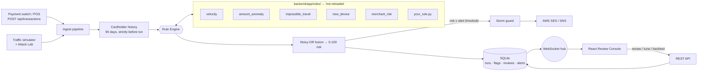

# AEGIS: Real-time Fraud Rule Engine + Review Console

> Every transaction is scored in **under 10 ms**, explained in plain English, pushed live to a reviewer console, and escalated through **AWS SES / SNS** when it crosses the high-risk line.
> New fraud rules are **hot-plugged**: drop a Python file into a folder and the engine starts using it within a second, with no restart and no change to the core.

```
./run.sh            →  http://localhost:8000
```

---

## Why AEGIS is different

| Most fraud demos | AEGIS |
|---|---|
| Hard-coded `if` statements inside the engine | **Plugin architecture.** Rules are auto-discovered `Rule` subclasses, **hot-reloaded from disk**, and **fault-isolated** (a crashing or syntax-broken rule is quarantined; scoring never stops) |
| "Flagged: yes/no" | **Explainable scoring.** Every rule reports confidence, weight, a human-readable reason and structured evidence. The console shows the exact **noisy-OR** math behind each score |
| Static threshold tweaking | **What-if backtesting.** Change weights, parameters or thresholds, replay recent real traffic, and see precision/recall *before* you ship |
| Rules judged by gut feeling | **Precision from reviewer verdicts.** Each "Clear" or "Confirm fraud" decision feeds a live per-rule precision metric |
| Static CSV of transactions | **Live traffic simulator** with 250 cardholders and 45 days of behavioural history, plus an **Attack Lab** that launches real fraud patterns on demand with ground-truth scoring |
| An email per event (alert storm) | **Alert storm guard.** One alert per cardholder per cooldown window; suppressed alerts are still logged and auditable |
| Table of rows | **Ops-grade console.** Live world map with impossible-travel arcs, keyboard triage (J/K/R/C/F), evidence visuals, audit trail, email preview |

---

## Problem statement → implementation

| Requirement | Where / how |
|---|---|
| Rule engine for transaction risk evaluation | `backend/app/engine/core.py`: discovery, isolation, noisy-OR fusion, risk levels |
| **Velocity** rule | `rules/velocity.py`: sliding window count, plus detection of the card-testing micro-charge signature |
| **Unusual amount** rule | `rules/amount_anomaly.py`: *personal* baseline via robust z-score (median + MAD), plus a cold-start ceiling |
| **Impossible geography** rule | `rules/impossible_travel.py`: haversine distance ÷ elapsed time vs. airliner speed |
| Add rules without modifying the core | Drop a file in `backend/app/rules/`. The watcher hot-loads it (demo: `examples/foreign_cashout.py`) |
| Persist transactions and fraud flags | SQLite (WAL) via SQLAlchemy: `transactions`, `flags`, `reviews`, `notifications`, `settings` |
| React reviewer console | `frontend/`: React 18 + Vite, live over WebSocket |
| Display flagged transactions | Command Center (map + live stream) and Review Queue (risk-sorted) |
| Mark reviewed / cleared | Buttons or keys **R**, **C**, plus **F** (confirmed fraud) and **U** (reopen). Every action is audit-logged with reviewer and note |
| AWS SES / SNS on high-risk threshold | `backend/app/notifier.py`: SES HTML+text email and/or SNS publish with message attributes, a dry-run fallback, and storm guard |

Two bonus rules ship to show composability: **Unrecognized Device** (with device trust-aging) and **High-Risk Merchant** (gift cards, crypto, wire, gambling).

---

## Architecture



**Scoring.** Each rule returns a confidence `s ∈ [0,1]`, and its contribution is `c = min(1, s × weight)`. Contributions are fused with a noisy-OR:

```
risk = 100 × (1 − Π (1 − cᵢ))
```

One overwhelming signal is enough on its own. Several weak, independent signals, such as a new device, a foreign country and a gift-card merchant, add up the way a human investigator's suspicion does. The score can never exceed 100, and the console prints this formula for every transaction.

| Level | Default range | Effect |
|---|---|---|
| low | < 35 | stored, visible in live stream |
| medium / high | 35 – 79 | **flagged** into the review queue |
| critical | ≥ 80 | flagged **and** SES/SNS alert |

Both thresholds are editable live from the Rules Lab and persisted.

---

## Quick start

Requirements: Python 3.9+ and Node 18+.

```bash
./run.sh              # installs everything on first run, builds the console, serves on :8000
./run.sh --reset      # fresh database with newly seeded cardholder history
```

Or with Docker:

```bash
docker build -t aegis . && docker run -p 8000:8000 --env-file .env aegis
```

API docs (Swagger) are served at **http://localhost:8000/docs**.

**Dev mode** (hot module reload for the UI):
```bash
cd backend && .venv/bin/uvicorn app.main:app --reload     # :8000
cd frontend && npm run dev                                  # :5173 (proxies /api and /ws)
```

---

## 3-minute demo script

1. **Command Center.** Traffic is already flowing (~70 txns/min). Point out the decision latency KPI (~5 ms).
2. **Attack Lab → Fraud Storm.** Four attacks hit four victims at once. Watch the red impossible-travel arcs and pulsing critical points on the map, the critical toasts, and the "Attacks caught 4/4" scoreboard. The Alerts tab shows 4 alerts sent and the duplicates **suppressed** by the storm guard.
3. **Review Queue.** Open the top item. Walk through *Why AEGIS scored it 97*: each rule's reason, the evidence visuals (globe arc with implied km/h, the velocity burst timeline, the amount strip vs. the cardholder's median) and the noisy-OR formula. Press **F** to confirm fraud; the queue auto-advances. Press **C** on a false positive. Click *Preview email* to show the exact SES message.
4. **Extensibility, live.** In a terminal:
   ```bash
   cp examples/foreign_cashout.py backend/app/rules/
   ```
   The toast "Rule hot-loaded: Foreign Cash-Out" appears within a second. Launch *Account Takeover* and the new rule fires on its first transaction. No restart, and the engine code is untouched.
5. **Rules Lab.** Raise *Unrecognized Device* weight → **Backtest**. The engine replays recent traffic under the proposed config and shows flagged before/after and precision/recall against reviewer labels plus attack ground truth. Click **Apply live**.
6. *(Optional)* Break a rule on purpose (a syntax error in a file). The console shows it **quarantined** and scoring continues.

---

## Writing a rule

```python
# backend/app/rules/round_amount.py
from app.engine import Rule, RuleResult

class RoundAmountRule(Rule):
    id = "round_amount"
    name = "Suspiciously Round Amount"
    description = "Fraudsters test cards with round numbers like $500.00"
    category = "behavioral"
    default_weight = 0.3
    params = {"min_amount": 200}                     # editable live in the console

    def evaluate(self, txn, ctx):
        if txn.amount >= self.p["min_amount"] and txn.amount % 100 == 0:
            return RuleResult(0.6, f"${txn.amount:,.0f} is a round-number charge",
                              {"amount": txn.amount})
        return None                                   # didn't fire
```

A rule receives a frozen `Txn` and a `RuleContext` with helpers: `history(within=, limit=)`, `last()`, `known_devices(older_than=)` and `known_countries()`. History is always strictly *before* the transaction being scored, so the same rule runs unchanged in real time and in backtests with no look-ahead leakage.

---

## AWS alerts

Out of the box AEGIS runs in **dry-run** mode. It renders and logs every alert, and the console shows `AWS DRY-RUN`. To go live:

1. In SES, verify the sender (and, while in the SES sandbox, the recipient) email address.
2. *(Optional)* Create an SNS topic and subscribe an email address, SMS number, Lambda or Slack webhook to it.
3. `cp .env.example .env`, fill in your credentials, `AEGIS_SES_FROM`, `AEGIS_SES_TO` and optionally `AEGIS_SNS_TOPIC_ARN`, then run `./run.sh`.

The badge switches to `AWS LIVE`. IAM permissions needed: `ses:SendEmail`, `sns:Publish`. Each alert contains the score, the transaction facts, the rule-by-rule explanation, and a deep link (`/?txn=<id>`) that opens that transaction in the console.

---

## API

| Method | Path | Purpose |
|---|---|---|
| POST | `/api/transactions` | Score + persist a transaction, returns full evaluation |
| GET | `/api/transactions?status=&level=&q=&sort=risk` | Query transactions |
| GET | `/api/transactions/{id}` | Detail: flags, evidence, cardholder baseline, timeline, alerts, audit |
| POST | `/api/transactions/{id}/review` | `{action: reviewed\|cleared\|fraud\|reopen, reviewer, note}` |
| GET / PATCH | `/api/rules`, `/api/rules/{id}` | Inspect / enable / reweight / re-parameterise rules |
| POST | `/api/rules/reload` | Force a rescan of the rules folder |
| POST | `/api/backtest` | Replay traffic with a proposed config (no side effects) |
| PATCH | `/api/settings/thresholds` | Flag / alert thresholds |
| GET | `/api/notifications`, `/api/notifications/preview/{id}` | Alert log, rendered email |
| POST | `/api/scenarios/{name}` | `card_testing`, `impossible_travel`, `amount_spike`, `account_takeover`, `fraud_storm` |
| PATCH | `/api/simulator` | `{running, rate}` |
| WS | `/ws` | Live events: `txn`, `review`, `alert`, `rules`, `stats`, `scenario` |

```bash
curl -X POST localhost:8000/api/transactions -H 'Content-Type: application/json' -d '{
  "user_id":"C100037","amount":4999,"merchant":"Night Market","category":"electronics",
  "city":"Tokyo","country":"JP","lat":35.68,"lon":139.69,"device_id":"dev_new","channel":"card_present"}'
```

---

## Tests

```bash
cd backend && .venv/bin/python -m pytest -q
```

The 12 tests cover plugin discovery, each rule firing and *not* firing, noisy-OR math, enable/re-weight, hot reload, quarantine of syntax-broken files, isolation of rules that raise at runtime, look-ahead safety, and an end-to-end API flow (ingest → flag → review → alert → backtest).

## Project layout

```
backend/app/
  engine/base.py      Rule contract, Txn, RuleContext, geo/stat helpers
  engine/core.py      discovery, hot reload, isolation, fusion, introspection
  rules/              ← plugins (velocity, amount_anomaly, impossible_travel, new_device, merchant_risk)
  service.py          ingest pipeline, websocket hub, review workflow, stats, backtest
  notifier.py         AWS SES / SNS with dry-run + storm guard
  simulator.py        cardholder population, seeding, attack scenarios
  main.py             FastAPI routes + serves the built console
frontend/src/
  components/         CommandCenter, WorldMap, ReviewQueue, TxnDetail, RulesLab, AttackLab, Alerts
examples/foreign_cashout.py   drop-in rule for the live extensibility demo
```
